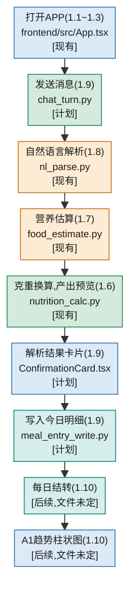
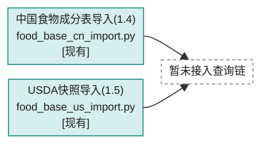
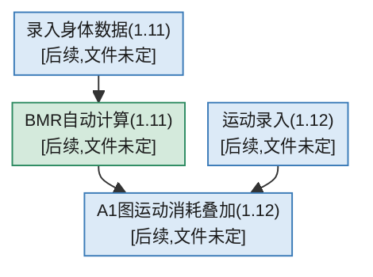
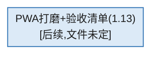

# Demo 1.1~1.13 业务流程总览

对照 `tasks/STATUS.md`(权威进度表)与 PRD §9.1 / SPEC §11.1(权威范围定义)。
这里展示的是**用户能感知到的业务流程走向**,不按 Feature Branch 分组、不写
具体函数名(函数级映射在各里程碑自己的详细文件里,这里只标到文件)。节点第二行
统一写**文件名**,不写函数名;除非标注,后端文件在 `backend/app/services/` 下,
前端组件在 `frontend/src/components/` 下(`App.tsx` 是例外,在 `frontend/src/`
根目录)。节点颜色表示**泳道**(用户操作/Front end/后端HTTP入口/Backend
Service/LLM/SQLite),不表示完成状态——完成状态看每个节点最后一行的
`[现有]`/`[计划]`/`[后续]` 文字标签。标注图例和泳道配色定义见
[README.md](README.md)。

## 主链路:记一餐饭,从打开 APP 到看到趋势图

排序按真实调用顺序,不按里程碑号,里程碑号标在每个节点文字的括号里,不用分区/分色区块表示"属于哪个 PR"。

## 支线一:食物基础数据备货

不在用户交互路径里,是后台一次性/定期跑的维护脚本,和上面主链路的营养估算暂时
没有连起来(两张表已导入,但四级查询链是 Closed Beta 目标设计,Demo/MVP 阶段
的营养估算不读这两张表,详见 [01_0608_food_query.md](01_0608_food_query.md)):

## 支线二:身体数据与运动

可以和主链路并行推进,最终汇合到 A1 趋势图。1.11 可在 1.6~1.8 完成后提前开工,
不依赖 1.9/1.10;1.12 需要 1.10 的图表和 1.11 的 BMR 都合入后才能做:

## 收尾

承接主链路(1.10)和支线二(1.12)全部完成之后:

## 快速对照表(里程碑 → Feature Branch → 详细文件)

| 里程碑  | Feature Branch                             | 详细文件                  |
| ------- | ------------------------------------------ | ------------------------- |
| 1.1~1.3 | `feature_demo_01_scaffold`               | (骨架,暂无独立文件)       |
| 1.4~1.5 | `feature_demo_02_food_base`              | (维护脚本,暂无独立文件)   |
| 1.6~1.8 | `feature_demo_03_query_engine`           | `01_0608_food_query.md` |
| 1.9     | `feature_demo_04_write_path`             | `01_09_write_path.md`   |
| 1.10    | `feature_demo_05_carryover_trend`        | 待建                      |
| 1.11    | `feature_demo_06_body_metrics`           | 待建                      |
| 1.12    | `feature_demo_07_exercise_trend_overlay` | 待建                      |
| 1.13    | `feature_demo_08_pwa_polish`             | 待建                      |
