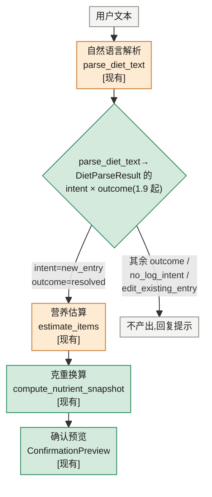

# 01·06~08 — 食物营养查询引擎(文本解析 + 营养估算)

对应 STATUS.md 1.6~1.8,`feature_demo_03_query_engine`(已合入 main)。

## 这一段业务在做什么

用户说一句话描述吃了什么,系统要把它变成"每样食物的克重 + 营养值"预览,供用户
确认后写入(写入本身是 1.9 的范围,见 [01_09_write_path.md](01_09_write_path.md))。

**范围边界**:这里只到"产出 `ConfirmationPreview`"为止,是纯 service 层——**没有
任何 HTTP 端点调用这些函数**,当前只被 pytest 直接调用验证。API 化、UI 接通是
1.9 的工作。

**SPEC §7.2 对照**:SPEC 定义的目标设计是"四级查询链"(个人常吃库→中国库→USDA→
LLM拆解),但那是 Closed Beta 目标设计;Demo/MVP 阶段按 SPEC §7.2 里程碑说明,
替换成"LLM 直接估算 per-100g 营养值"这个等价占位分支——`food_base_cn`/
`food_base_us` 两张表当前**已导入但不被这条查询路径读取**(只被各自导入 CLI
读写)。四级查询链本身在代码里是 0% 实现,不是"没做完的一半"。

## 业务环节 → 代码

| 业务环节                                                    | 函数/组件                                                  | 输入                                           | 输出                                      | 泳道            | 文件位置                                   |
| ----------------------------------------------------------- | ---------------------------------------------------------- | ---------------------------------------------- | ----------------------------------------- | --------------- | ------------------------------------------ |
| 自然语言解析:把一句话拆成食物名/克重/单位/生熟状态/餐次     | `parse_diet_text` `[现有]`                             | `user_text`(1.9 起可选 `today_context`)     | `DietParseResult`(intent × outcome 两维,1.9 起;items) | LLM             | `backend/app/services/nl_parse.py`       |
| 单个食物营养估算:凭食物名+生熟状态让 LLM 给出 per-100g 营养 | `estimate_food` `[现有]`                               | `food_name`、`preparation_state`           | `FoodEstimate`(per-100g 营养 + 置信度)  | LLM             | `backend/app/services/food_estimate.py`  |
| 一批食物并发估算                                            | `estimate_items` `[现有]`                              | `items: list[ParsedFoodItem]`、`meal_slot` | `list[ItemEstimateOutcome]`             | LLM             | `backend/app/services/food_estimate.py`  |
| 按实际克重换算营养快照                                      | `compute_nutrient_snapshot` `[现有]`                   | `per_100g`、`quantity_g`                   | `NutrientSet`(逐字段 null 传播)         | Backend Service | `backend/app/services/nutrition_calc.py` |
| LLM 供应商适配(被上面两步共用)                              | `DashScopeClient`/`create_dashscope_client` `[现有]` | system/user prompt                             | `LlmJsonResult`                         | LLM             | `backend/app/services/llm_client.py`     |

## 简化流程

## 需要考虑的错误情况

- **没有记录意图/想改已有记录**(1.9 起):`intent=no_log_intent`/
  `edit_existing_entry`,`outcome` 为 None,`message` 直接是得体回应文案。
- **输入信息不全**:缺数量/生熟不明确 → `needs_clarification`,追问。
- **LLM 服务不可用**:网络/超时/限流耗尽/未配置 Key → `service_unavailable`。
- **模型输出不合规**:非法 JSON 或不满足 Pydantic 契约 → 重试一次,仍失败则
  `invalid_model_output`。
- **估算结果不可信**:`kcal_100g` 全 null → 视为不可信,不算 resolved。
- **批量估算部分失败**:单项失败不拖累同批其它项(`estimate_items` 保序返回)。

## 测试映射

| 测试文件                                         | 覆盖                                         |
| ------------------------------------------------ | -------------------------------------------- |
| `tests/backend/test_demo_03_nl_parse.py`       | `parse_diet_text` intent×outcome 代码层正确性 |
| `tests/backend/test_demo_03_food_estimate.py`  | `estimate_food`/`estimate_items`         |
| `tests/backend/test_demo_03_nutrition_calc.py` | `compute_nutrient_snapshot` 换算/null 传播 |
| `tests/backend/test_demo_03_llm_client.py`     | `DashScopeClient` 失败通道                 |
| `backend/scripts/eval_nl_parse.py`(非 pytest)  | 117 条真实评测,intent/outcome 两维准确率     |
