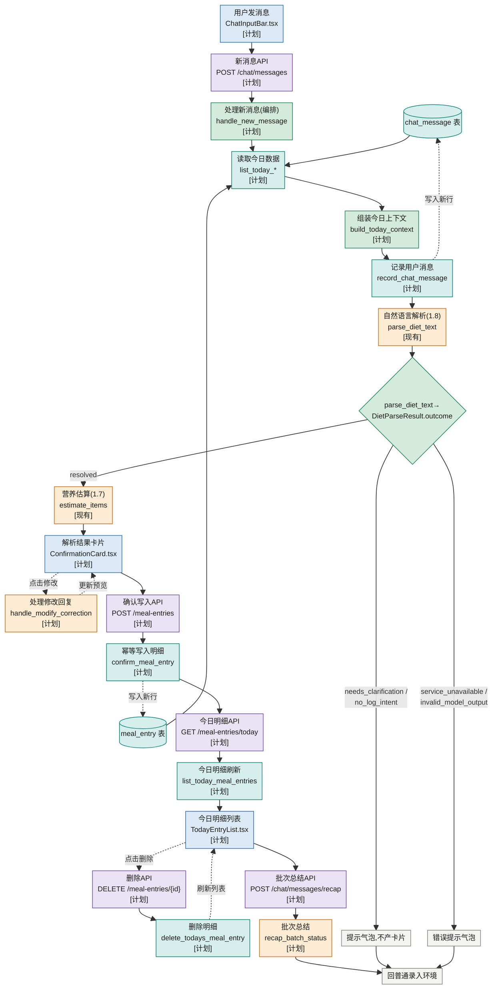
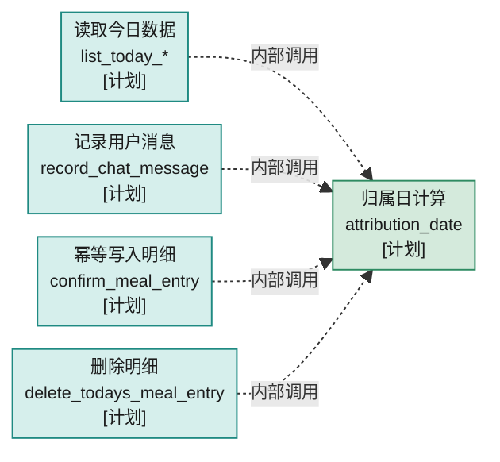

# 01·09 — 写入 + 今日明细 UI

对应 STATUS.md 1.9,`feature_demo_04_write_path`(**计划中,尚未实现**)。完整
设计见 [tasks/current.md](../current.md);这里只做"业务环节 → 计划中的代码"的
高层映射,不重复 current.md 里已经很详细的状态机图。

## 这一段业务在做什么

把 1.6~1.8 产出的"估算预览"真正落库,并接通前端:用户发消息 → 解析结果卡片 →
逐项确认/修改 → 卡片顶部批量确认/放弃 → 写入 `meal_entry` → 今日明细表格。

## 业务环节 → 计划中的代码

| 业务环节                                        | 函数/组件                                                                 | 输入                                                       | 输出                                | 泳道            | 文件位置                                                            |
| ----------------------------------------------- | ------------------------------------------------------------------------- | ---------------------------------------------------------- | ----------------------------------- | --------------- | ------------------------------------------------------------------- |
| 归属日计算(用户时区,不是服务器时区)             | `attribution_date` `[1.9计划]`                                        | UTC 时刻 + 时区配置                                        | 归属日字符串                        | Backend Service | `backend/app/services/attribution.py`                             |
| 读取今日对话历史(供组装上下文用)                | `list_today_chat_messages` `[1.9计划]`                                | —                                                         | `list[ChatMessage]`               | SQLite          | `backend/app/services/chat.py`                                    |
| 组装今日上下文(对话 + 明细)喂给解析             | `build_today_context` `[1.9计划]`                                     | 已读取的`messages`/`entries` 列表(纯格式化,自己不查库) | 拼好的上下文字符串                  | Backend Service | `backend/app/services/chat_turn.py`                               |
| 记录用户这条新消息                              | `record_chat_message` `[1.9计划]`                                     | `role="user"`、`content=user_text`                     | 写入的`ChatMessage`               | SQLite          | `backend/app/services/chat.py`                                    |
| 处理一条新消息(编排:组装上下文→解析→估算)     | `handle_new_message` `[1.9计划]`                                      | `user_text`                                              | `ChatTurnResult`(outcome + items) | Backend Service | `backend/app/services/chat_turn.py`                               |
| ↳ 内部调用:自然语言解析                        | `parse_diet_text` `[现有]`(1.8,复用)                                  | `user_text`、`today_context`                           | `DietParseResult`(四态 outcome)   | LLM             | `backend/app/services/nl_parse.py`                                |
| ↳ 内部调用:resolved 时的营养估算               | `estimate_items` `[现有]`(1.7,复用)                                   | `items`、`meal_slot`                                   | `list[ItemEstimateOutcome]`       | LLM             | `backend/app/services/food_estimate.py`                           |
| 处理"修改"回复(内部同样复用`parse_diet_text`) | `handle_modify_correction` `[1.9计划]`                                | 原识别项 + 修正文本                                        | 单项新预览                          | Backend Service | `backend/app/services/chat_turn.py`                               |
| 幂等写入正式明细                                | `confirm_meal_entry` `[1.9计划]`                                      | `ConfirmationPreview` + `confirmation_id`              | `MealEntry`                       | SQLite          | `backend/app/services/meal_entry_write.py`                        |
| 今日明细查询(供上下文/UI 两处复用)/删除         | `list_today_meal_entries`/`delete_todays_meal_entry` `[1.9计划]`    | — /`entry_id`                                           | `list[MealEntry]` / `bool`      | SQLite          | `backend/app/services/meal_entry_write.py`                        |
| 批次结束总结                                    | `recap_batch_status` `[1.9计划]`                                      | 终态列表                                                   | 一条总结`ChatMessage`             | LLM             | `backend/app/services/chat_turn.py`                               |
| 新消息 API                                      | `POST /chat/messages` `[1.9计划]`                                     | `ChatMessageIn`                                          | `ChatTurnResponse`                | 后端HTTP入口    | `backend/app/routers/chat.py`                                     |
| 批次总结 API                                    | `POST /chat/messages/recap` `[1.9计划]`                               | `RecapRequest`                                           | `RecapResponse`                   | 后端HTTP入口    | `backend/app/routers/chat.py`                                     |
| 确认写入 API                                    | `POST /meal-entries` `[1.9计划]`                                      | `ConfirmMealEntryRequest`                                | `MealEntryOut`                    | 后端HTTP入口    | `backend/app/routers/meal_entries.py`                             |
| 今日明细/删除 API                               | `GET /meal-entries/today` / `DELETE /meal-entries/{id}` `[1.9计划]` | —                                                         | `list[MealEntryOut]` / 204        | 后端HTTP入口    | `backend/app/routers/meal_entries.py`                             |
| 对话输入组件                                    | `ChatInputBar` `[1.9计划]`                                            | 用户打字                                                   | 触发新消息 API                      | Front end       | `frontend/src/components/ChatInputBar.tsx`                        |
| 解析结果卡片                                    | `ConfirmationCard` `[1.9计划]`                                        | `ItemEstimateOutcome[]`                                  | 逐项 确认/修改/放弃 UI              | Front end       | `frontend/src/components/ConfirmationCard.tsx`                    |
| 今日明细列表                                    | `TodayEntryList`/`MealEntryRow` `[1.9计划]`                         | `MealEntryOut[]`                                         | 删除按钮(卡片未结束时禁用)          | Front end       | `frontend/src/components/TodayEntryList.tsx`/`MealEntryRow.tsx` |
| 整体状态机归属地                                | `RecordTab` `[1.9计划]`                                               | —                                                         | 协调上面所有组件                    | Front end       | `frontend/src/components/RecordTab.tsx`                           |

## 简化流程

节点数比之前多——按维护规则 9,表格里出现的每一步(含跨里程碑复用的 1.7/1.8)都在图里出现。`chat_message`/`meal_entry` 画成圆柱形数据节点,代表 SQLite 里**同一张表**——

两条实线箭头(→ READ)是"读今日已有的行",两条虚线箭头(从`REC`/`F` 绕回来)是"写入新行":`record_chat_message` 往 `chat_message` 插一行,`confirm_meal_entry` 往 `meal_entry` 插一行,读和写走的是同一张表,不是两份数据。

`record_chat_message` 实际每轮会被调用两次(先写用户这句话,流程末尾还会再写一次 AI 的回复),这里只画一个节点代表这个函数,不重复画两遍调用。

虚线`点"修改"`/`点删除`同样是次要交互,完成后绕回主路径,不是终态分支。

`RecordTab.tsx` 没有单独画节点——它是包住 `ConfirmationCard`/`TodayEntryList`的前端状态机容器,自己不对应流程里的某一个时间点,而是驱动图里 `F1`/`G1`/`H1`/`DELAPI` 这几次 API 调用的发起方(表格里仍有它自己的一行)。

`attribution_date` 不在这张图里出现——它不是这条链路上的一个步骤,而是被多个函数各自内部调用的共享工具,单独画在下面"支线:归属日计算"里。

## 支线:归属日计算(共享工具)

`attribution_date` 不是这条链路自己编排出来的步骤,是被多个直接摸 SQLite 的函数各自内部调用的共享纯函数——`handle_new_message` 自己第一步调的是`list_today_*`(current.md 507 行),不直接调 `attribution_date`。

current.md第 410 行还写明 1.10 的结转任务以后也要复用同一个函数,不是 1.9 专属的一次性步骤,所以单独拆出来画,不占上面主链路的位置:

## 需要考虑的错误情况(MECE)

- **解析/估算失败**:见 01_0608_food_query.md 的错误列表(继承自 1.6~1.8)。
- **单项写入失败**:保留暂存态 + 错误提示,可通过再次点顶部"确认"重试(幂等键兜底)。
- **网络重试导致重复写入**:`confirmation_id` 唯一索引在应用层和数据库层双重防护。
- **用户中途切走**:输入框直接打字但仍有未结束项 → 二次确认弹窗,选择放弃才继续。
- **归属日边界**:所有"今日"查询按 `attribution_date()`,不是滚动 24 小时窗口。

## 测试映射(计划中,尚未创建)

| 测试文件(计划)                                           | 覆盖                                                                       |
| -------------------------------------------------------- | -------------------------------------------------------------------------- |
| `tests/backend/test_demo_04_meal_entry_idempotency.py` | 幂等写入                                                                   |
| `tests/backend/test_demo_04_chat_turn.py`              | `handle_new_message`/`handle_modify_correction`/`recap_batch_status` |
| `tests/backend/test_demo_04_context_builders.py`       | `build_today_context` 等                                                 |
| `frontend/src/tests/demo_04_record_tab_flow.test.tsx`  | 端到端集成                                                                 |

完整测试清单见 `tasks/current.md` 第四、六节。
