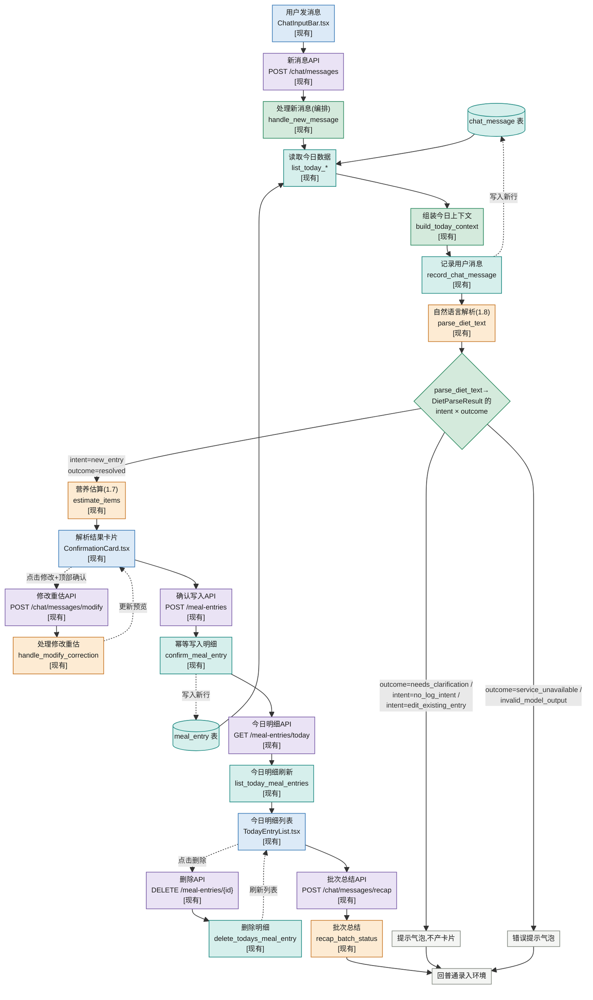
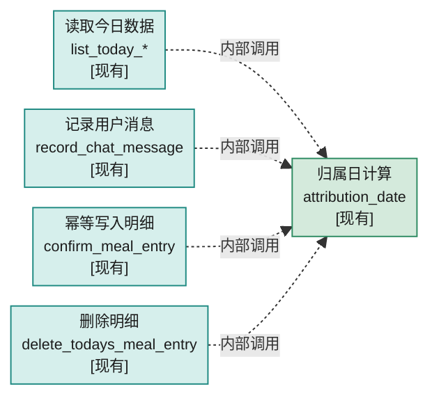
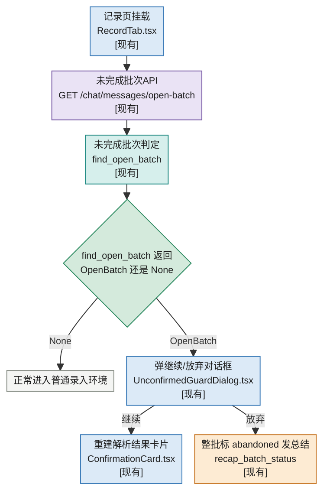

# 01·09 — 写入 + 今日明细 UI

对应 STATUS.md 1.9,`feature_demo_04_write_path`(**代码已实现,测试全绿**)。完整
设计见 [tasks/current.md](../current.md);这里只做"业务环节 → 代码"的高层映射,
不重复 current.md 里已经很详细的状态机图。

## 这一段业务在做什么

把 1.6~1.8 产出的"估算预览"真正落库,并接通前端:用户发消息 → 解析结果卡片 →
逐项确认/修改 → 卡片顶部批量确认/放弃 → 写入 `meal_entry` → 今日明细表格。
1.9 同时把 1.8 的 `DietParseResult` 扩成 **intent × outcome 两维契约**(用户想
干什么 × 这次解析成不成功),`handle_new_message` 先按 intent 分支再按 outcome 分支。

## 业务环节 → 代码

| 业务环节                                        | 函数/组件                                                                 | 输入                                                       | 输出                                | 泳道            | 文件位置                                                            |
| ----------------------------------------------- | ------------------------------------------------------------------------- | ---------------------------------------------------------- | ----------------------------------- | --------------- | ------------------------------------------------------------------- |
| 归属日计算(用户时区,不是服务器时区)             | `attribution_date` `[现有]`                                        | UTC 时刻 + 时区配置                                        | 归属日字符串                        | Backend Service | `backend/app/services/attribution.py`                             |
| 读取今日对话历史(供组装上下文用)                | `list_today_chat_messages` `[现有]`                                | —                                                         | `list[ChatMessage]`               | SQLite          | `backend/app/services/chat.py`                                    |
| 组装今日上下文(对话 + 明细)喂给解析             | `build_today_context` `[现有]`                                     | 已读取的`messages`/`entries` 列表(纯格式化,自己不查库) | 拼好的上下文字符串                  | Backend Service | `backend/app/services/chat_turn.py`                               |
| 记录用户这条新消息                              | `record_chat_message` `[现有]`                                     | `role="user"`、`content=user_text`                     | 写入的`ChatMessage`               | SQLite          | `backend/app/services/chat.py`                                    |
| 处理一条新消息(编排:组装上下文→解析→估算)     | `handle_new_message` `[现有]`                                      | `user_text`                                              | `ChatTurnResult`(intent/outcome + items) | Backend Service | `backend/app/services/chat_turn.py`                               |
| ↳ 内部调用:自然语言解析                        | `parse_diet_text` `[现有]`(1.8,1.9 扩展 intent+today_context)         | `user_text`、`today_context`                           | `DietParseResult`(intent×outcome) | LLM             | `backend/app/services/nl_parse.py`                                |
| ↳ 内部调用:resolved 时的营养估算               | `estimate_items` `[现有]`(1.7,复用)                                   | `items`、`meal_slot`                                   | `list[ItemEstimateOutcome]`       | LLM             | `backend/app/services/food_estimate.py`                           |
| 处理"修改"重估(内部同样复用`parse_diet_text`) | `handle_modify_correction` `[现有]`                                | 原识别项 + 修正文本(不带 today_context)                    | `ModifyCorrectionResult`(单项新预览或失败原因) | Backend Service | `backend/app/services/chat_turn.py`                               |
| 未完成批次判定(刷新恢复用,纯查询)               | `find_open_batch` `[现有]`                                         | —                                                         | `OpenBatch \| None`                | SQLite          | `backend/app/services/chat_turn.py`                               |
| 幂等写入正式明细                                | `confirm_meal_entry` `[现有]`                                      | `ConfirmationPreview` + `confirmation_id` + `now_utc` | `MealEntry`                       | SQLite          | `backend/app/services/meal_entry_write.py`                        |
| 今日明细查询(供上下文/UI 两处复用)/删除         | `list_today_meal_entries`/`delete_todays_meal_entry` `[现有]`    | — /`entry_id`                                           | `list[MealEntry]` / `bool`      | SQLite          | `backend/app/services/meal_entry_write.py`                        |
| 批次结束总结                                    | `recap_batch_status` `[现有]`                                      | 终态列表(LLM 失败退化成确定性文案)                          | 一条总结`ChatMessage`             | LLM             | `backend/app/services/chat_turn.py`                               |
| 新消息 API                                      | `POST /chat/messages` `[现有]`                                     | `ChatMessageIn`                                          | `ChatTurnResponse`                | 后端HTTP入口    | `backend/app/routers/chat.py`                                     |
| 修改重估 API                                    | `POST /chat/messages/modify` `[现有]`                              | `ModifyCorrectionRequest`                                | `ModifyCorrectionResponse`        | 后端HTTP入口    | `backend/app/routers/chat.py`                                     |
| 批次总结 API                                    | `POST /chat/messages/recap` `[现有]`                               | `RecapRequest`                                           | `RecapResponse`                   | 后端HTTP入口    | `backend/app/routers/chat.py`                                     |
| 今日对话/未完成批次查询 API                     | `GET /chat/messages/today` / `GET /chat/messages/open-batch` `[现有]` | —                                                    | `list[ChatMessageOut]` / `OpenBatchOut \| null` | 后端HTTP入口 | `backend/app/routers/chat.py`                                     |
| 确认写入 API                                    | `POST /meal-entries` `[现有]`                                      | `ConfirmMealEntryRequest`                                | `MealEntryOut`(幂等命中也是 201)  | 后端HTTP入口    | `backend/app/routers/meal_entries.py`                             |
| 今日明细/删除 API                               | `GET /meal-entries/today` / `DELETE /meal-entries/{id}` `[现有]` | —                                                         | `list[MealEntryOut]` / 204        | 后端HTTP入口    | `backend/app/routers/meal_entries.py`                             |
| 对话输入组件(含修改模式本地暂存)                | `ChatInputBar` `[现有]`                                            | 用户打字                                                   | 触发发送/本地暂存修正文本           | Front end       | `frontend/src/components/ChatInputBar.tsx`                        |
| 对话气泡展示                                    | `ChatHistory` `[现有]`                                             | `ChatMessageOut[]`                                       | 气泡列表                            | Front end       | `frontend/src/components/ChatHistory.tsx`                         |
| 解析结果卡片                                    | `ConfirmationCard` `[现有]`                                        | `PendingItem[]`                                          | 逐项 确认/修改 + 顶部 确认/放弃 UI  | Front end       | `frontend/src/components/ConfirmationCard.tsx`                    |
| 通用二次确认对话框(未确认拦截/恢复/删除三处复用) | `UnconfirmedGuardDialog` `[现有]`                                 | 场景文案                                                   | 确认/取消回调                       | Front end       | `frontend/src/components/UnconfirmedGuardDialog.tsx`              |
| 今日明细列表                                    | `TodayEntryList`/`MealEntryRow` `[现有]`                         | `MealEntryOut[]`                                         | 删除按钮(卡片未结束时禁用)          | Front end       | `frontend/src/components/TodayEntryList.tsx`/`MealEntryRow.tsx` |
| 整体状态机归属地                                | `RecordTab` `[现有]`                                               | —                                                         | 协调上面所有组件                    | Front end       | `frontend/src/components/RecordTab.tsx`                           |

## 简化流程

节点数比之前多——按维护规则 9,主链路上的每一步(含跨里程碑复用的 1.7/1.8)都在图里出现。`chat_message`/`meal_entry` 画成圆柱形数据节点,代表 SQLite 里**同一张表**——

两条实线箭头(→ READ)是"读今日已有的行",两条虚线箭头(从`REC`/`F` 绕回来)是"写入新行":`record_chat_message` 往 `chat_message` 插一行,`confirm_meal_entry` 往 `meal_entry` 插一行,读和写走的是同一张表,不是两份数据。

`record_chat_message` 实际每轮会被调用两次以上(先写用户这句话,识别播报/总结也各写一次),这里只画一个节点代表这个函数,不重复画多遍调用。

虚线`点"修改"`/`点删除`同样是次要交互,完成后绕回主路径,不是终态分支。"点修改"到真正发出修改重估请求之间隔着"输入框暂存修正文本→顶部确认批量触发"两步本地操作(完整状态机见 current.md),图里合并为一条虚线。

`RecordTab.tsx`/`ChatHistory.tsx`/`UnconfirmedGuardDialog.tsx` 没有单独画节点——`RecordTab` 是包住其它组件的前端状态机容器,驱动图里 `F1`/`G1`/`H1`/`MODAPI`/`DELAPI` 这几类 API 调用的发起;`ChatHistory` 是纯展示层(图里的各种"气泡"都由它渲染);`UnconfirmedGuardDialog` 是三处复用的确认弹层(表格里各有一行)。

`attribution_date` 不在这张图里出现——它不是这条链路上的一个步骤,而是被多个函数各自内部调用的共享工具,单独画在下面"支线:归属日计算"里;`find_open_batch`/open-batch API 只在页面挂载恢复时走,画在"支线:未完成批次的恢复"里。

## 支线:归属日计算(共享工具)

`attribution_date` 不是这条链路自己编排出来的步骤,是被多个直接摸 SQLite 的函数各自内部调用的共享纯函数——`handle_new_message` 自己第一步调的是`list_today_*`,不直接调 `attribution_date`。

1.10 的结转任务以后也要复用同一个函数(current.md 已写明),不是 1.9 专属的一次性步骤,所以单独拆出来画,不占上面主链路的位置。**归属日的时间来源**:卡片顶部"确认"这类批量动作由前端生成一次 UTC 时刻,同一批所有请求携带同一个值,后端不自己读当前时刻(批次归属日一致性,见 current.md)。

## 支线:未完成批次的恢复(页面挂载时)

识别结果的完整快照落在播报消息(`kind='recognition'`)的 `food_summary_json` 里,收尾总结(`kind='recap'`)复用同一 `batch_id` 表示"这批关闭了"。恢复不靠前端本地持久化——"这批有没有写完"是后端可以直接回答的问题。

## 需要考虑的错误情况(MECE)

- **解析/估算失败**:见 01_0608_food_query.md 的错误列表(继承自 1.6~1.8);估算失败的项只进播报文字不进卡片,全部失败时不产卡片。
- **单项写入失败**:保留暂存态 + 错误提示,可通过再次点顶部"确认"重试(幂等键兜底)。
- **修改重估失败**:数值退回修改前,"修改:…"留痕替换为失败提示,项回到待处理。
- **网络重试导致重复写入**:`confirmation_id` 唯一索引在应用层和数据库层双重防护。
- **recap 总结失败**:LLM 失败退化成确定性拼装文案;recap 请求本身失败则放弃不重试(下次挂载 `find_open_batch` 若发现数据已全部写完也不会误报)。
- **用户中途切走**:输入框直接打字但仍有未结束项 → 二次确认弹窗,选择放弃才继续;刷新/关闭页面 → 挂载时恢复支线。
- **归属日边界**:所有"今日"查询按 `attribution_date()`,不是滚动 24 小时窗口;同一批写入共用前端生成的同一个 `now_utc`。

## 测试映射

| 测试文件 `[现有]`                                          | 覆盖                                                                       |
| -------------------------------------------------------- | -------------------------------------------------------------------------- |
| `tests/backend/test_demo_04_attribution.py`            | 归属日边界/时区来源/偏移量                                                 |
| `tests/backend/test_demo_04_schema_migration.py`       | 迁移(confirmation_id + 批次追踪三列)与空表保护                             |
| `tests/backend/test_demo_04_meal_entry_idempotency.py` | 幂等写入(应用层+数据库层)                                                  |
| `tests/backend/test_demo_04_meal_entry_write.py`       | 今日明细查询过滤/排序/删除防御                                             |
| `tests/backend/test_demo_04_chat_service.py`           | 对话消息写入/归属日过滤/批次追踪列                                         |
| `tests/backend/test_demo_04_context_builders.py`       | `build_today_context` 等三个纯函数                                       |
| `tests/backend/test_demo_04_nl_parse_context.py`       | `today_context` 注入 prompt                                              |
| `tests/backend/test_demo_04_chat_turn.py`              | `handle_new_message`/`handle_modify_correction`/`find_open_batch`/`recap_batch_status` |
| `tests/backend/test_demo_04_chat_router.py`            | 对话路由各分支                                                             |
| `tests/backend/test_demo_04_meal_entries_router.py`    | 明细路由(含幂等重复 POST)                                                  |
| `tests/backend/test_demo_04_llm_live.py`               | 三处新 LLM 调用点真实 API 冒烟(`llm_live` 默认不跑)                       |
| `frontend/src/tests/demo_04_chat_input.test.tsx`       | 输入胶囊/修改模式                                                          |
| `frontend/src/tests/demo_04_confirmation_card.test.tsx` | 卡片展示/互斥双态/禁用/错误展示                                           |
| `frontend/src/tests/demo_04_unconfirmed_guard.test.tsx` | 通用二次确认对话框                                                        |
| `frontend/src/tests/demo_04_today_entry_list.test.tsx` | 分组/小计/空态/删除禁用联动                                                |
| `frontend/src/tests/demo_04_record_tab_flow.test.tsx`  | 端到端集成(完整闭环/追问循环/恢复/拦截)                                    |

完整测试清单见 `tasks/current.md` 第四、六节。
